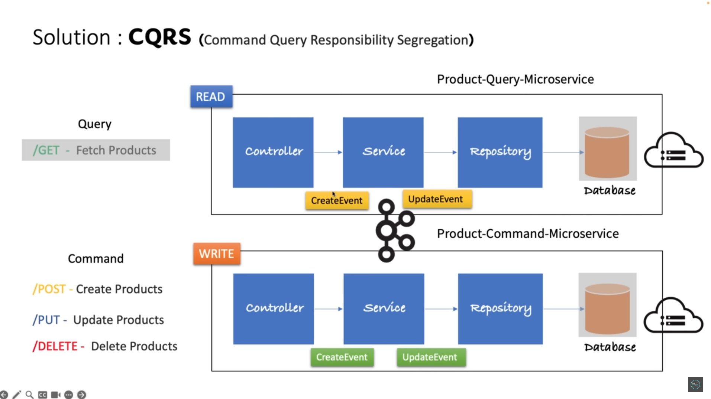

[![LinkedIn][linkedin-shield]][linkedin-url]

<h1 align = "center"> E-Commerce CQRS Implementation</h1>

<!-- ABOUT THE PROJECT -->
## About The Project

CQRS implementation for product domain. The project consists of two microservices  
 i. product-command-service  
ii. product-query-service

### Built With
* SpringBoot 3.3.2
* SpringData JPA
* Postgres
* Docker

### Port Configuration

* product-command-service: `9090`
* product-query-service: `9091`
* product-command-db: `5433`
* product-query-db: `5432`
* kafka: `29092`

### Architecture



<!-- GETTING STARTED -->
## Getting Started

### Prerequisites
Make sure you have Docker and Docker Compose installed on your machine.

* Docker
* Docker Compose

Check docker is installed
  ```sh
  docker --version
  ```

### Installing
Clone the repository:

  ```sh
  git clone https://github.com/aatifansari/E-commerce-CQRS-Implementation
  cd E-commerce CQRS Implementation
  ```

### Setup with Docker Compose
To start the application, run:

  ```sh
  docker-compose up -d
  ```

This command will build the necessary Docker images (if they don't exist) and start the containers in detached mode.

### Stopping the Application
To stop the application and remove the containers, run:

  ```sh
  docker-compose down
  ```

## Usage

* Add product 

  ```sh
  curl --location 'http://localhost:9090/products/save' \
  --header 'Content-Type: application/json' \
  --data '{
  "name" : "Fridge",
  "description" : "LG",
  "price" : 99999.99
  }'
  ```

* Get All Product

  ```sh
  curl --location 'http://localhost:9091/products'
  ```


<!-- MARKDOWN LINKS & IMAGES -->
[linkedin-shield]: https://img.shields.io/badge/-LinkedIn-black.svg?style=for-the-badge&logo=linkedin&colorB=555
[linkedin-url]: https://www.linkedin.com/in/mohd-atif-9b1122173/